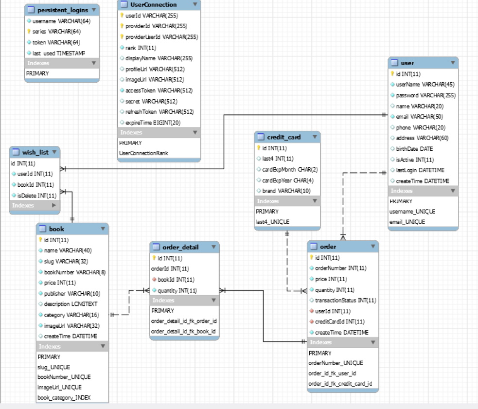
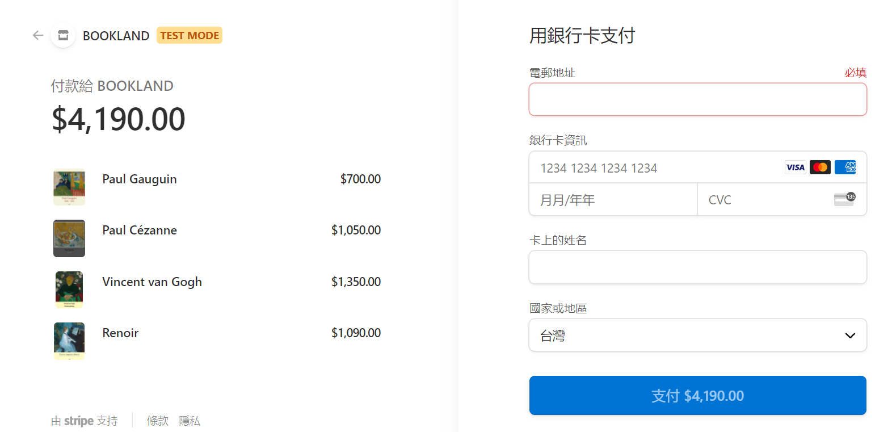
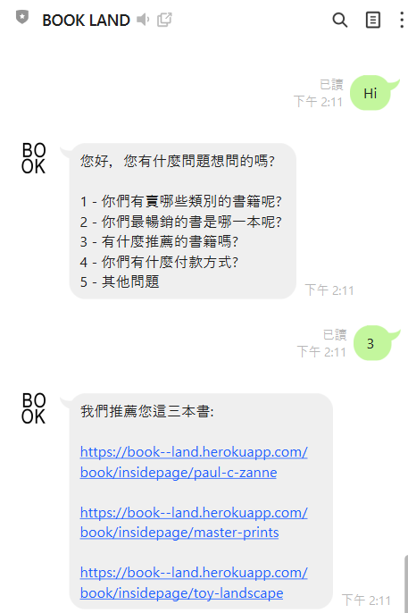

# BOOKLAND

---
Demo: https://book--land.herokuapp.com/

此專案為一個線上藝術書店

---

部屬平台: Heroku (https://www.heroku.com/)

資料庫: MySQL

前端: CSS3 + HTML5 + JavaScript(ES6) + JQuery + RWD + BootStrap4

後端: Spring Boot(JAVA) + MyBatis

其他: Docker

## Hierarchy


---

## Features
- 瀏覽商品
- 註冊/登入(含第三方登入(Google、Facebook))
- 購物車(使用 Cookie)
- 刷卡結帳(使用第三方金流(Stripe))
- 簡易聊天機器人(Line Bot) 

<br>

### 刷卡結帳 demo

- Stripe 測試模式下只接受 VISA、Mastercard 和 American Express

- Email 與 卡上的姓名必填，但是隨便填就好

- 信用卡到期日輸入至少為今年當月，否則會出現過期錯誤

- CVC 檢查碼任意輸入三碼即可

測試卡號:
```text
4242 4242 4242 4242 VISA
4000 0566 5566 5556 VISA
5555 5555 5555 4444 Mastercard
3782 822463 10005 American Express
```

其餘測試卡號: https://stripe.com/docs/testing



<br>

### 聊天機器人 Demo

輸入指定數字回覆訊息，其餘訊息則不認得




## Development

---

將 `application.yml-sample` 改成 `application.yml` 並將裡面的參數替換成自己的。

e.g.
```yaml
spring:
  # facebook
  social:
    facebook:
      appId: {YOUR_APP_ID}
      appSecret: {YOUR_APP_SECRET}
  thymeleaf:
    prefix: classpath:/templates/
    suffix: .html
  resources:
    static-locations: classpath:/
  
  # 資料庫相關
  datasource:
    driver-class-name: {YOUR_DRIVER}
    url: jdbc:{YOUR_DATABASE}://{YOUR_HOST}:3306/{DB_NAME}?useUnicode=true&characterEncoding=UTF-8
    username: {YOUR_USERNAME}
    password: {YOUR_PASSWORD}
    security:
      oauth2:
        client:
          registration:
            google:
              client-id: {YOUR_CLIENT_ID}
              client-secret: {YOUR_CLIENT_SECRET}
# MyBatis 設定
mybatis:
  mapper-locations: classpath:/com/bookland/mapper/*.xml
  type-aliases-package: com.bookland.entity

# 日誌相關設定
logging:
  level:
    root: info
    com.bookland.dao: debug
    com.bookland.controller: debug

# 分頁 plug in
pagehelper:
  helperDialect: mysql
  reasonable: false
  params: count=countSql
  supportMethodsArguments: true

# Stripe API(金流)
stripe:
  publicKey: {YOUR_PUBLIC_KEY}
  secretKey: {YOUR_SECRET_KEY}

# 本地開發設定為 http://localhost:8080
domain: {YOUR_DOMAIN_NAME}

# AWS S3，開發模式下可以不用設定，除非為正式環境(prod)
AWS_S3: {YOUR_AWS_S3}

# Line Bot(聊天機器人)
line.bot:
  channel-token: {YOUR_CHANNEL_TOKEN}
  channel-secret: {YOUR_CHANNEL_SECRET}
  handle.path: {YOUR_CALLBACK_URL}
```

<br>

替換成:
```yaml
spring:
  # facebook
  social:
    # 以下為範例，請改成自己的
    facebook:
      appId: 012345678123
      appSecret: 1a2b3c4d5e6f
  thymeleaf:
    prefix: classpath:/templates/
    suffix: .html
  resources:
    static-locations: classpath:/
  datasource:
    driver-class-name: com.mysql.jdbc.Driver
    url: jdbc:mysql://localhost:3306/test?useUnicode=true&characterEncoding=UTF-8
    username: user
    password: password

... 以下省略
```
